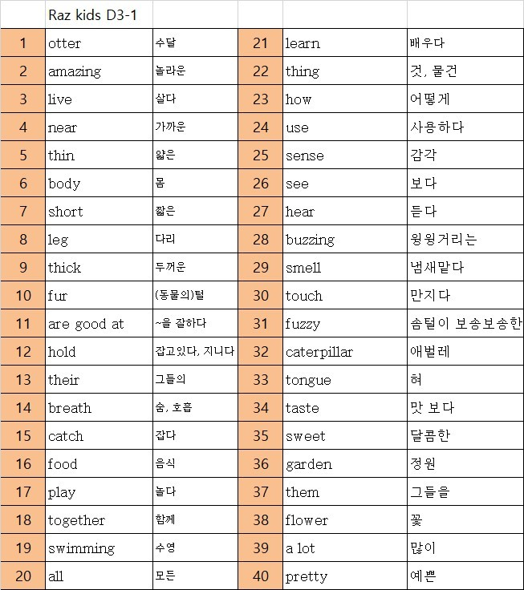
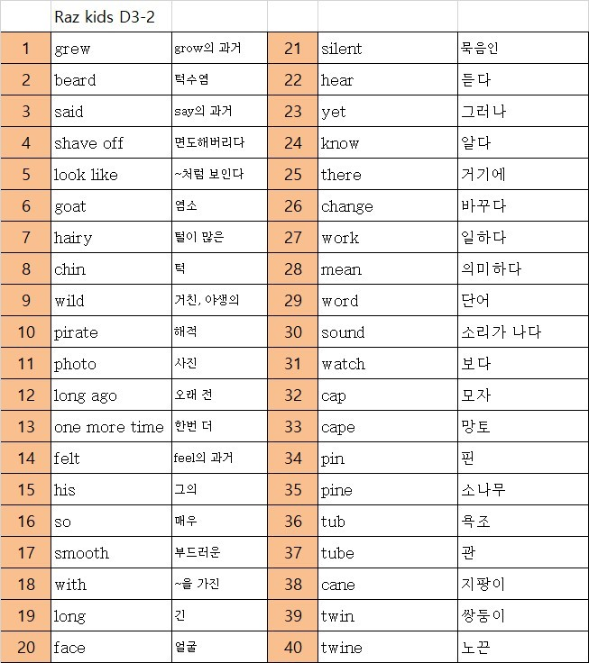

# 표 OCR 인쇄 도우미 (Electron)

사진 속 표(영어/한글 혼합)를 VLM(Vision-Language Model)으로 인식해서,
영어 전용 시험지 / 한글 전용 시험지(각각 오른쪽에 답 쓰는 빈 칸 포함, 세로 A4, 1페이지 1표)를 만들어
인쇄하거나 PDF로 저장하는 Windows용 Electron 앱입니다.

## 실행 방법

```
npm install
npm start
```

## 지원하는 사진 형태

이 앱은 실제로 아래와 같은 단어표 사진으로 테스트했습니다 (`samples/` 폴더).

|  |  |
| --- | --- |

- 기본 구조는 왼쪽부터 **순번(번호) → 영어 → 한글 뜻** 순서의 표입니다.
- 위 샘플처럼 **한 페이지에 이 3열 블록이 좌우로 2개 나란히 붙어 있는 형태**(예: 1~20번은 왼쪽 블록, 21~40번은 오른쪽 블록)도 지원합니다 — 인식 시 영어/한글 열이 각각 2개씩 잡히는데, 인쇄용 표에서는 각 영어(또는 한글) 열마다 답 쓰는 빈 칸이 바로 옆에 따로 붙어서 나옵니다.
- 순번 열은 인식은 되지만 인쇄/PDF 출력에는 포함되지 않습니다(필요 없는 정보라 항상 제외).
- 사진 한 장에 위 구조와 많이 다른 표(예: 열 순서가 다르거나 3열 이상의 다른 정보가 섞인 표)는 인식 정확도가 떨어질 수 있습니다.

## 표 인식 방식

설정(⚙)에서 둘 중 하나를 선택할 수 있습니다.

- **OpenAI (GPT-4o Vision, 클라우드)**: API 키 필요, 인터넷 연결 필요, 인식 정확도가 가장 높음
- **Ollama (로컬 모델)**: PC에 설치된 Ollama의 vision 모델(예: `qwen2.5-vl`, `llama3.2-vision`, `qwen3-vl` 등) 사용, 오프라인/무료 가능하나 표 인식 정확도는 모델에 따라 GPT-4o보다 낮을 수 있음. Ollama 서버가 꺼져 있으면 앱이 자동으로 실행을 시도합니다.

## 사용 흐름

1. **업로드 & 인식**: 표가 있는 사진을 드래그하거나 클릭해서 선택(**여러 장 동시 선택 가능**) → "표 인식 시작" 클릭
   - 처음 실행 시 우측 상단 "⚙ 설정"에서 인식 방식(OpenAI/Ollama)과 API 키 또는 로컬 모델 정보를 입력해야 합니다.
   - 인식 중에는 진행률 표시줄이 단계별로 표시됩니다(여러 장이면 진행 중인 파일 번호도 함께 표시).
2. **결과 확인/수정**: 인식된 표가 편집 가능한 테이블로 나타납니다. 여러 장을 올렸다면 파일별 탭으로 구분됩니다.
   - 각 열이 영어/한글/기타 중 무엇인지 드롭다운으로 확인·수정
   - 셀 텍스트는 클릭해서 직접 수정, 행 삭제 가능
3. **인쇄 미리보기**: 두 가지 탭 제공 (모두 세로 A4, 표 1개당 1페이지 — 여러 장을 올렸다면 그만큼 페이지가 이어짐)
   - **영어 전용 (한글 답 쓰기)**: 영어 열만 남기고 오른쪽에 "한글 뜻 쓰기" 빈 칸 추가 — 영어 보고 한글 뜻 맞히기
   - **한글 전용 (영어 답 쓰기)**: 한글 열만 남기고 오른쪽에 "English 쓰기" 빈 칸 추가 — 한글 보고 영어 맞히기
   - 각 탭에서 "🖨 인쇄" 또는 "PDF로 저장" 가능

## Windows 배포용 패키징 (선택)

```
npm run dist
```

`electron-builder`로 NSIS 설치 파일을 생성합니다 (인터넷 연결 필요, 최초 실행 시 빌드 리소스 다운로드).

## 참고

- 설정(API 키 등)은 프로젝트 폴더가 아니라 `%APPDATA%\table-ocr-print\settings.json`에 저장됩니다(git에 포함되지 않음).
- OpenAI를 사용할 경우 API 사용 요금이 발생하며 인터넷 연결이 필요합니다. Ollama(로컬)를 사용하면 오프라인으로도 동작합니다.
